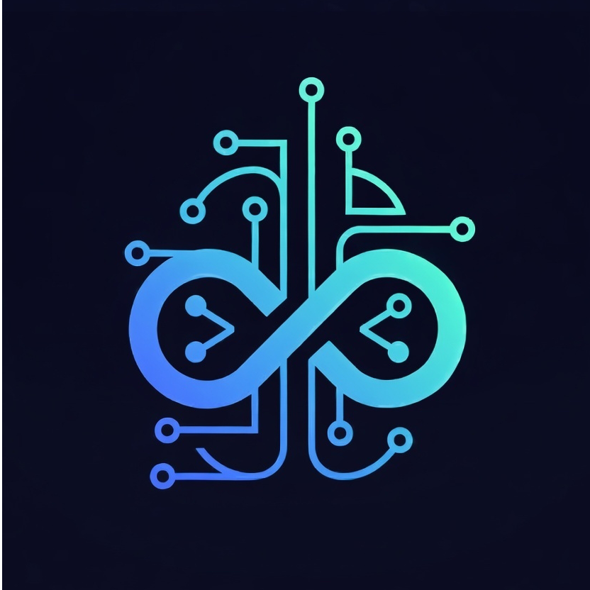

<p align="center">
  
</p>

# Autonomo MCP

**Give your AI eyes and hands.**

Your AI can finally see and drive your running apps — all of them, at once.
It reads structured JSON state, interacts with UI elements, and knows instantly whether something worked or broke.

No screenshots. No hallucinations. No "trust me bro."

Just real, live, visual pair programming.

> Works with: GitHub Copilot • Claude Code • Cursor • Windsurf • Any MCP-compatible AI

🌐 https://sebringj.github.io/autonomo/

<p align="center">
  
</p>

---

## What is Autonomo MCP?

Your AI coding assistant is brilliant. It can write code, refactor systems, and reason about architecture. But it's been doing all of that **blind** — unable to see what it built or drive the interfaces it created.

It writes a component, tells you "that should work," and moves on. You compile. You run. You check the screen. You report back: "Nope, still broken."

Autonomo fixes this.

It gives your AI **live access to your app's structured JSON state** — screens, elements, errors, user info — across web, iOS, Android, and desktop. Your AI can read that state, interact with UI elements, and know instantly whether something worked or broke. Not by looking at pixels — by reading real data. **While you're still developing**. Not after.

**The old loop:**
```
Write code → Compile → Run → Squint at screen → Describe what you see → Hope the AI understands
```

**The Autonomo loop:**
```
Tell the AI what you want → Watch it build and interact live → Correct in real time
```

### How It Works

After every action, your AI gets a unified snapshot of everything that happened:

```
AI sends command: {"action": "press", "target": "Submit"}
                              ↓
            ═══ UNIFIED SNAPSHOT RETURNED ═══

UI State:
  screen: "confirmation"
  elements: ["Order.Number", "Order.Details", "Home.Button"]

App State:
  orderId: "ORD-12345"
  cartCleared: true

Network:
  POST /api/orders → 201 (245ms)
  response: { id: "ORD-12345", status: "confirmed" }

Errors:
  [] (none)

Console:
  ["Order created successfully"]
```

Your AI doesn't guess what happened. It **sees everything**. And if something broke, it fixes it immediately.

### Why Not Screenshots?

| Vision-Based (Screenshots) | Autonomo |
|----------------------------|----------|
| 🐢 ~2-5s per screenshot analysis | ⚡ ~50ms structured response |
| 💸 1000+ tokens per image | 🪶 ~50 tokens per state report |
| 🖥️ Different tools per platform | 🌐 One protocol for web, iOS, Android, desktop |
| 👁️ Only sees pixels on screen | 🔍 Sees app state, network calls, errors, auth |
| 🎯 Coordinates break on resize | 🏷️ Semantic IDs survive redesigns |
| 👤 Single device at a time | 👥 **Multi-device**: develop User A → User B flows |
| 🔐 Struggles with OTP/OAuth | 🎬 **Custom actions**: bypass auth flows locally |

---

## ⚡ Get Started in 30 Seconds

**Just tell your AI assistant:**

```
Install Autonomo in my project. Read https://github.com/sebringj/autonomo/blob/main/QUICKSTART.md
```

Your AI handles the rest — installing packages, configuring MCP, and adding the bridge to your app.

### Platform-Specific Prompts

Copy-paste the prompt for your platform:

**React / Next.js / Remix:**
```
Install Autonomo for my React app. Read https://github.com/sebringj/autonomo/blob/main/QUICKSTART.md
```

**React Native / Expo:**
```
Install Autonomo for my React Native app. Read https://github.com/sebringj/autonomo/blob/main/QUICKSTART.md
```

**Swift / iOS:**
```
Install Autonomo for my Swift iOS app. Read https://github.com/sebringj/autonomo/blob/main/packages/autonomo-swift/README.md
```

**Flutter:**
```
Install Autonomo for my Flutter app. Read https://github.com/sebringj/autonomo/blob/main/packages/autonomo_flutter/README.md
```

**Python:**
```
Install Autonomo for my Python app. Read https://github.com/sebringj/autonomo/blob/main/packages/autonomo-python/README.md
```

**Ruby:**
```
Install Autonomo for my Ruby app. Read https://github.com/sebringj/autonomo/blob/main/packages/autonomo-ruby/README.md
```

**Kotlin / Android:**
```
Install Autonomo for my Kotlin app. Read https://github.com/sebringj/autonomo/blob/main/packages/autonomo-kotlin/README.md
```

**C# / .NET:**
```
Install Autonomo for my C# app. Read https://github.com/sebringj/autonomo/blob/main/packages/Autonomo.CSharp/README.md
```

**Angular:**
```
Install Autonomo for my Angular app. Read https://github.com/sebringj/autonomo/blob/main/packages/@autonomo/angular/README.md
```

**Deno Fresh:**
```
Install Autonomo for my Deno Fresh app. Read https://github.com/sebringj/autonomo/blob/main/docs/DENO_FRESH_INTEGRATION.md
```

### After Installation

Ask your AI:

> "What elements can you see in my app?"

> "Press the Login button and tell me what happens"

The AI will actually interact with your running app and report results. 🎉

### Need Help?

Ask your AI to call the help tool for documentation:

```
"Call autonomo_help to show me how to set up local development"
"Call autonomo_help with topic recommend for guidance"
"Call autonomo_help with topic local-development/auth-bypass"
```

Topics include: `overview`, `recommend`, `elements`, `custom-actions`, `troubleshooting`, and `local-development/*` sub-topics for AWS, Azure, GCP emulators, auth bypass, payments, and more.

---

## Why This Matters: The End of Blind Coding

AI coding assistants have a dirty secret: they hallucinate. They write code, say "that should work," and move on. Without eyes on the running app, they can't prove anything.

Autonomo changes the equation:

| Without Autonomo | With Autonomo |
|------------------|---------------|
| AI says "that should work" | AI **proves** it works by interacting with the live app |
| False confidence in untested code | Validated outcomes, real results |
| "I've updated the code" (hope it's right) | "I've verified the fix works" (proved it) |
| You describe the bug, AI guesses the fix | AI sees the bug, AI fixes the bug |

**Your AI goes from "I think" to "I verified":**

```
Before: AI writes code → hopes it works → moves on → bugs found later

After:  AI writes code → sees the result → spots the failure → fixes it →
        confirms success → moves on with confidence
```

This is the missing sense. Vision. The thing that makes AI coding actually reliable and joyful.

---

## Built for the Inner Loop

Autonomo lives where you develop — your local machine, your running app, your tight iteration cycle:

```
                      YOUR LOCAL MACHINE

    [Editor]          [Autonomo]          [Your App]
    + AI Tool    ◄───►  Server     ◄───►  (localhost)
        │
        ▼
    Write code → AI interacts immediately → See results → Fix → Repeat

    ════════════════════════════════════════════════════════
    100% LOCAL • NO CLOUD • NO LATENCY • NO DATA LEAVING
    ════════════════════════════════════════════════════════
```

**Key Principles:**
- 🔌 **MCP-Native** - One integration works with Copilot, Claude, Cursor, and more
- 🔒 **100% Local** - Nothing leaves your machine, ever
- 🌐 **Language Agnostic** - HTTP protocol works with any stack
- 🆓 **Free for Most** - Free under $1M revenue, [see license](LICENSE.md)

## Detect → Act → Iterate

This is the development loop your AI runs continuously:

1. **DETECT** - Get current state (UI + app + network + errors)
2. **ACT** - Send command (navigate, press, fill, call API)
3. **ITERATE** - See unified result, decide next step or fix code

The AI doesn't guess what happened. It **sees everything** and can fix issues immediately.

## Multi-Device Development

Building a chat feature? A multiplayer game? Anything with multiple users?

Autonomo supports **multiple simultaneous app instances** — browser tabs, simulator windows, separate processes. Your AI can drive them all:

```
🟢 my-app-a3f7c2d1 (web)     ← Browser Tab 1
   Screen: checkout
   Elements: 12

🟢 my-app-b8e4f9a2 (web)     ← Browser Tab 2
   Screen: settings
   Elements: 8

🟢 my-app-c1d6e3b7 (mobile)  ← iOS Simulator
   Screen: home
   Elements: 15
```

**Example**: "On Device A, send a message. On Device B, verify it arrives."

Your AI sees both sides. In real time. One development session.

## Custom Actions

Some interactions are complex — OTP entry, OAuth flows, multi-step wizards. Custom actions let you create shortcuts your AI can call like any other command:

**Example**: Register a `devLogin` action that bypasses OTP/OAuth during local development — your AI calls it like any other action.

See [Custom Actions Guide](./docs/CUSTOM_ACTIONS.md) for details.

---

## Production Safety (devOnly)

All Autonomo packages include a **`devOnly`** option (default: `true`) that automatically disables the bridge in production environments. This means:

- ✅ **Safe by default** - Bridge won't run in production builds
- ✅ **No code changes** - Just deploy your app normally
- ✅ **Zero overhead** - No WebSocket connections, no state reporting

**How it works:**

| Platform | Detection Method |
|----------|-----------------|
| **React** | `process.env.NODE_ENV === 'production'` |
| **React Native** | `__DEV__ === false` |
| **Angular** | `ngDevMode` or `NODE_ENV` |
| **Python** | `ENV`, `ENVIRONMENT`, `APP_ENV` variables |
| **Ruby** | `RACK_ENV`, `RAILS_ENV`, `ENV` variables |
| **Swift** | `DEBUG` preprocessor flag, env variables |
| **Kotlin** | `ENV`, `NODE_ENV` environment variables |
| **Flutter** | `Platform.environment` variables |
| **C#/.NET** | `ASPNETCORE_ENVIRONMENT`, `DOTNET_ENVIRONMENT` |

**To explicitly enable in production** (rarely needed):

```typescript
// React/React Native
useAutonomo({ name: 'my-app', devOnly: false })

// Angular
autonomo.init({ name: 'my-app', devOnly: false })
```

```python
# Python
transport = create_http_transport(TransportConfig(port=8080, dev_only=False))
```

```swift
// Swift
createHttpTransport(TransportConfig(devOnly: false))
```

## Platform Support

| Platform | Package | Status |
|----------|---------|--------|
| **React** | `@autonomo/react` | ✅ Production-ready |
| **React Native** | `@autonomo/react-native` | ✅ Production-ready |
| **Swift/iOS** | `autonomo-swift` | 🧪 Tests pass |
| **Flutter** | `autonomo_flutter` | 🧪 Tests pass |
| **Python** | `autonomo-python` | 🧪 Tests pass |
| **Ruby** | `autonomo-ruby` | 🧪 Tests pass |
| **Kotlin/Android** | `autonomo-kotlin` | 🧪 Tests pass |
| **C#/.NET** | `Autonomo.CSharp` | 🧪 Tests pass |
| **Angular** | `@autonomo/angular` | 🧪 Tests pass |
| **Deno Fresh** | See [docs](./docs/DENO_FRESH_INTEGRATION.md) | ✅ Production-ready |

## Architecture: Metadata-Based, Not HTML-Based

**Autonomo doesn't parse DOM or HTML.** It uses a self-registration pattern:

```
              ═══ METADATA REGISTRY PATTERN ═══

Your UI Framework (any)
    │
    ▼
Component mounts → registers with bridge:

    { id: "Checkout.Submit",
      type: "button",
      onTap: () => handleSubmit() }

Component unmounts → unregisters
    │
    ▼
Bridge maintains registry:

    elements: Map<string, { type, handler, value }>

When command arrives → look up handler → invoke
```

**This pattern works on ANY framework that supports:**
1. **Lifecycle hooks** - Know when views/controls mount/unmount
2. **Callbacks** - Attach handlers to elements
3. **HTTP client** - Report state, receive commands

That's basically every UI framework ever built.

### Works Everywhere (Same Pattern)

| Platform | Lifecycle Hook | Registration |
|----------|---------------|--------------|
| **React/Preact** | `useEffect` | Hook registers on mount |
| **React Native** | `useEffect` | Same as React |
| **Vue** | `onMounted`/`onUnmounted` | Composable registers |
| **Svelte** | `onMount`/`onDestroy` | Action registers |
| **Angular** | `ngOnInit`/`ngOnDestroy` | Directive registers |
| **Solid** | `onMount`/`onCleanup` | Same pattern |
| **SwiftUI** | `.onAppear`/`.onDisappear` | View modifier registers |
| **UIKit** | `viewDidAppear`/`viewWillDisappear` | VC registers |
| **Jetpack Compose** | `LaunchedEffect`/`DisposableEffect` | Composable registers |
| **Android Views** | `onAttachedToWindow`/`onDetachedFromWindow` | View registers |
| **Flutter** | `initState`/`dispose` | Widget registers |
| **Qt/QML** | `Component.onCompleted`/`onDestruction` | Item registers |
| **Electron** | DOM + IPC | Web bridge + native hooks |
| **CLI/TUI** | Command registration | Commands as "elements" |

**The control APIs are the same regardless of framework:**

```typescript
// Register a tappable element
registerTapHandler("Checkout.Submit", () => handleSubmit());

// Register a fillable input
registerFillHandler("Checkout.Email", (value) => setEmail(value));

// Register a screen/view
registerScreen("checkout", { cartItems: 3, total: 45.99 });
```

**If your framework has lifecycle hooks and callbacks, Autonomo works.**

## MCP Tools

| Tool | Description |
|------|-------------|
| `autonomo_validate` | **Primary validation tool** - Interact with features and see clear PASS/FAIL results |
| `autonomo_help` | Get documentation, recommendations, and guidance on any topic |
| `autonomo_restore_context` | Restore AI context after summarization - returns recent actions and current state |
| `autonomo_list_bridges` | List all connected apps with status |
| `autonomo_get_state` | Get state from one or all bridges (supports `expand` parameter) |
| `autonomo_send_command` | Send command to specific bridge |
| `autonomo_wait_for` | Wait for condition on a bridge |
| `autonomo_run_scenario` | Execute multi-step interaction scenario |
| `autonomo_register_bridge` | Connect a new app by URL |

### Smart Element Grouping

When an app has many repetitive elements (like calendar days or list items), `autonomo_get_state` automatically collapses them to reduce noise:

```
Elements:
- AIChat.Panel → tap
- AIChat.Input → fill
- WebApp.Schedule.Day.* (44 items, tap)   ← Collapsed!
- WebApp.Nav.teams → tap
```

**Expanding Groups:**
Use the `expand` parameter to drill into a collapsed group:

```
get_state(bridge: "web", expand: "WebApp.Schedule.Day")
```

### Errors-First Display

Errors are always shown at the TOP of state output, not buried in elements:

```
⚠️ Error: league_id, title, and start_at are required

Screen: "schedule"
Elements:
- ...
```

## Integration Model: Docs + AI, Not SDKs

**Traditional approach:** Ship an SDK per framework, maintain 20 packages, version hell.

**Autonomo approach:** Ship **integration guides** (markdown) that AI coding agents use to integrate.

```
Developer: "Add Autonomo to my Vue app"
                    ↓
AI Agent reads: autonomo/guides/vue.md

  Contains:
    • Vue lifecycle patterns (onMounted, onUnmounted)
    • Composable template for registration
    • Example integration code
    • Verification steps
                    ↓
AI Agent writes the integration code tailored to YOUR app

    • Creates autonomo.ts composable
    • Wraps your existing components
    • Adds IDs to key elements
    • Verifies integration works via Autonomo itself!
```

**The AI verifies its own work:**

```
AI: "I've added Autonomo to your Vue app. Let me verify..."

[AI uses Autonomo tools to interact with the integration]

AI: "✅ Confirmed - I can see 12 elements registered.
     Pressed LoginButton - works correctly."
```

## Installation

**npm (install from GitHub):**
```bash
# Core
npm install github:sebringj/autonomo#packages/@autonomo/core

# React
npm install github:sebringj/autonomo#packages/@autonomo/react

# React Native
npm install github:sebringj/autonomo#packages/@autonomo/react-native

# MCP Server
npm install github:sebringj/autonomo#packages/@autonomo/mcp-server
```

**Python:**
```bash
pip install git+https://github.com/sebringj/autonomo.git#subdirectory=packages/autonomo-python
```

**Ruby:**
```ruby
# Gemfile
gem 'autonomo', git: 'https://github.com/sebringj/autonomo.git', glob: 'packages/autonomo-ruby/*.gemspec'
```

**Swift (Package.swift):**
```swift
.package(url: "https://github.com/sebringj/autonomo.git", from: "0.1.0")
// Then add to target: .product(name: "Autonomo", package: "autonomo")
```

**Flutter (pubspec.yaml):**
```yaml
dependencies:
  autonomo:
    git:
      url: https://github.com/sebringj/autonomo.git
      path: packages/autonomo_flutter
```

**Start MCP server in multi-bridge mode:**
```bash
autonomo-mcp --multi
# Or with initial bridges:
autonomo-mcp --multi --bridge http://localhost:3000/autonomo --bridge http://localhost:8081/autonomo
```

## Packages

| Package | Platform | Install |
|---------|----------|---------|
| [@autonomo/core](./packages/@autonomo/core) | **JavaScript / TypeScript** | `npm install github:sebringj/autonomo#packages/@autonomo/core` |
| [@autonomo/mcp-server](./packages/@autonomo/mcp-server) | MCP Server | `npm install github:sebringj/autonomo#packages/@autonomo/mcp-server` |
| [@autonomo/react](./packages/@autonomo/react) | React | `npm install github:sebringj/autonomo#packages/@autonomo/react` |
| [@autonomo/react-native](./packages/@autonomo/react-native) | React Native / Expo | `npm install github:sebringj/autonomo#packages/@autonomo/react-native` |
| [autonomo-cli](./packages/autonomo-cli) | CLI | `npm install -g github:sebringj/autonomo#packages/autonomo-cli` |
| [autonomo_flutter](./packages/autonomo_flutter) | Flutter / Dart | See [Installation](#installation) |
| [autonomo-python](./packages/autonomo-python) | Python | See [Installation](#installation) |
| [autonomo-ruby](./packages/autonomo-ruby) | Ruby | See [Installation](#installation) |
| [Autonomo.CSharp](./packages/Autonomo.CSharp) | C# / .NET | 📋 TODO (needs NuGet) |
| [autonomo-swift](./packages/autonomo-swift) | Swift / iOS / macOS | See [Installation](#installation) |
| [autonomo-kotlin](./packages/autonomo-kotlin) | Kotlin / JVM / Android | 📋 TODO (needs JitPack) |

**Note:** `@autonomo/core` is the base JS/TS package - use it for vanilla JavaScript, Node.js, web components, Electron, or any framework without a dedicated package. The React and React Native packages are thin wrappers around core.

## Documentation

- [QUICKSTART.md](./QUICKSTART.md) - **Fastest path** - Get running in 30 seconds
- [CONTRIBUTING.md](./CONTRIBUTING.md) - **Contributing** - How to contribute to Autonomo
- [docs/CUSTOM_ACTIONS.md](./docs/CUSTOM_ACTIONS.md) - **Custom actions** - Fast-path operations for complex interactions
- [MCP_INTEGRATION.md](./MCP_INTEGRATION.md) - How Autonomo works with AI tools
- [TEST_BRIDGE_ARCHITECTURE.md](./TEST_BRIDGE_ARCHITECTURE.md) - Deep dive on implementation
- [PROTOCOL_SPECIFICATION.md](./PROTOCOL_SPECIFICATION.md) - Universal HTTP API (language-agnostic)
- [docs/DENO_FRESH_INTEGRATION.md](./docs/DENO_FRESH_INTEGRATION.md) - Deno Fresh islands architecture
- [PRODUCT_ROADMAP.md](./PRODUCT_ROADMAP.md) - Feature roadmap
- [BUSINESS_PLAN.md](./BUSINESS_PLAN.md) - Open source → Enterprise business model

## License

**Dual License: AGPL-3.0 + Commercial**

| Your Situation | License | Cost |
|----------------|---------|------|
| Open source project (AGPL-compatible) | AGPL-3.0 | Free |
| Company with <$1M annual revenue | Commercial | **Free** |
| Company with ≥$1M annual revenue | Commercial | [Contact for terms](mailto:mail@jasonsebring.com) |

**TL;DR**: Under $1M revenue? Use it however you want, free. Over $1M and want to keep your code closed? [Get a commercial license](mailto:mail@jasonsebring.com).

See [LICENSE.md](./LICENSE.md) for full details.

---

**Develop by seeing, not guessing.**

Your AI can finally watch what it's building.

---

<p align="center">
  <sub>If Autonomo makes your AI coding better, a ⭐ or <a href="https://github.com/sponsors/sebringj">sponsorship</a> helps keep it moving.</sub>
</p>
