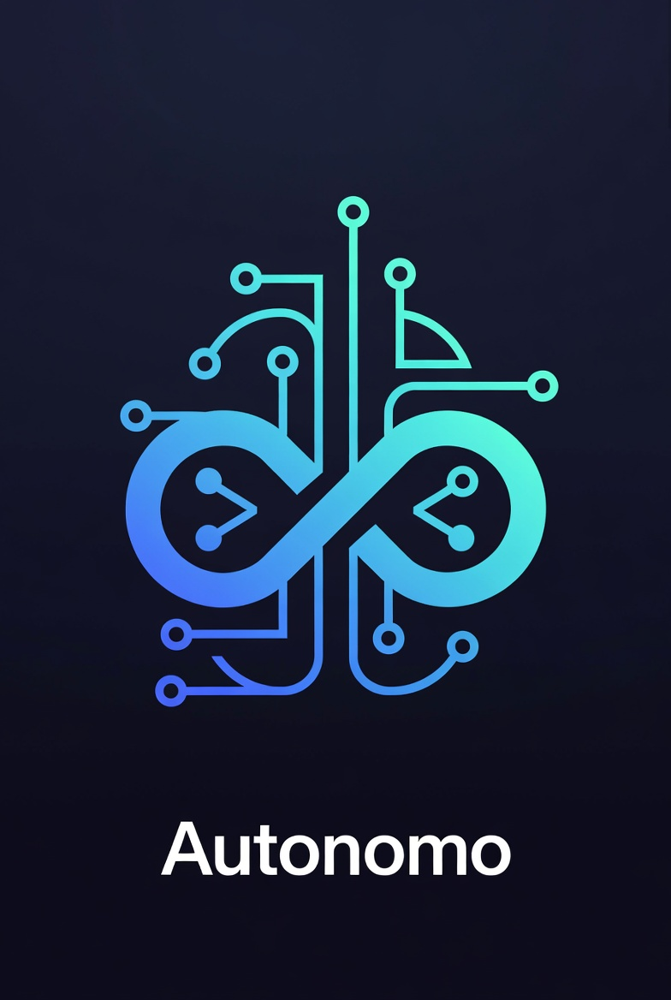

<p align="center">
  
</p>

# Autonomo MCP — Build -> Verify -> Fix (repeat)

> au·ton·o·mo | \ ä-ˈtä-nə-ˌmō \

> Works with: GitHub Copilot • Claude Code • Cursor • Windsurf • Any MCP-compatible AI

Autonomo enables AI coding assistants to observe app state, drive multiple devices simultaneously, and validate cross-device interactions — all in one iterative development loop.

### Why Autonomo?

| Vision-Based Testing | Autonomo |
|---------------------|----------|
| 🐢 ~2-5s per screenshot analysis | ⚡ ~50ms structured response |
| 💸 1000+ tokens per image | 🪶 ~50 tokens per state report |
| 🖥️ Different tools per platform | 🌐 One protocol for web, iOS, Android, desktop |
| 👁️ Only sees pixels on screen | 🔍 Sees app state, network calls, errors, auth |
| 🎯 Coordinates break on resize | 🏷️ Semantic IDs survive redesigns |
| 👤 Single device at a time | 👥 **Multi-device**: test User A → User B flows |

**Multi-user testing example**: "On Device A, send a message. On Device B, verify it arrives."

---

## ⚡ Quick Start

**Just tell your AI assistant:**

```
Install Autonomo in my project. Read https://github.com/sebringj/autonomo/blob/main/QUICKSTART.md
```

Your AI will handle the rest — installing packages, configuring MCP, and adding the bridge to your app.

### Platform-Specific Prompts

Copy-paste the prompt for your platform:

**React / Next.js / Remix:**
```
Install Autonomo for my React app. Read https://github.com/sebringj/autonomo/blob/main/QUICKSTART.md
```

**React Native / Expo:**
```
Install Autonomo for my React Native app. Read https://github.com/sebringj/autonomo/blob/main/QUICKSTART.md
```

**Swift / iOS:**
```
Install Autonomo for my Swift iOS app. Read https://github.com/sebringj/autonomo/blob/main/packages/autonomo-swift/README.md
```

**Flutter:**
```
Install Autonomo for my Flutter app. Read https://github.com/sebringj/autonomo/blob/main/packages/autonomo_flutter/README.md
```

**Python:**
```
Install Autonomo for my Python app. Read https://github.com/sebringj/autonomo/blob/main/packages/autonomo-python/README.md
```

**Ruby:**
```
Install Autonomo for my Ruby app. Read https://github.com/sebringj/autonomo/blob/main/packages/autonomo-ruby/README.md
```

**Kotlin / Android:**
```
Install Autonomo for my Kotlin app. Read https://github.com/sebringj/autonomo/blob/main/packages/autonomo-kotlin/README.md
```

**C# / .NET:**
```
Install Autonomo for my C# app. Read https://github.com/sebringj/autonomo/blob/main/packages/Autonomo.CSharp/README.md
```

**Deno Fresh:**
```
Install Autonomo for my Deno Fresh app. Read https://github.com/sebringj/autonomo/blob/main/docs/DENO_FRESH_INTEGRATION.md
```

### After Installation

Ask your AI:

> "What elements can you see in my app?"

> "Press the Login button and tell me what happens"

The AI will actually interact with your running app and report results. 🎉

---

## The Core Insight

**After every action, the LLM gets a unified snapshot of what happened across all levels:**

```
LLM sends command: {"action": "press", "target": "Submit"}
                              ↓
            ═══ UNIFIED SNAPSHOT RETURNED ═══

UI State:
  screen: "confirmation"
  elements: ["Order.Number", "Order.Details", "Home.Button"]

App State:
  orderId: "ORD-12345"
  cartCleared: true

Network:
  POST /api/orders → 201 (245ms)
  response: { id: "ORD-12345", status: "confirmed" }

Errors:
  [] (none)

Console:
  ["Order created successfully"]
                              ↓
LLM can now:
  • Verify the action worked
  • See exactly what failed if it didn't
  • Iterate with the next command
  • Fix code if there's an error
```

**This enables the Detect → Act → Iterate loop:**

1. **DETECT** - Get current state (UI + app + network + errors)
2. **ACT** - Send command (navigate, press, fill, call API)
3. **ITERATE** - See unified result, decide next step or fix

The LLM doesn't guess what happened. It **sees everything** and can fix issues immediately.

## Why This Matters: Eliminating AI Hallucinations

**The problem with AI coding today:**

| Without Autonomo | With Autonomo |
|------------------|---------------|
| LLM says "that should work" | LLM **proves** it works by running it |
| False confidence in untested code | Validated outcomes, real results |
| Hallucinated fixes that don't compile | Iterates until tests actually pass |
| "I've updated the code" (hope it's right) | "I've verified the fix works" (proved it) |

**Autonomo turns "I think" into "I verified":**

```
Before: LLM writes code → hopes it works → moves on → bugs found later

After:  LLM writes code → tests it → sees failure → fixes → tests again → 
        confirms success → moves on with confidence
```

This **dramatically reduces hallucinations** because the LLM can't claim success without proof. It must iterate until the actual app behaves correctly.

## Built for Local Development

Autonomo is designed for the **inner development loop** - the tight cycle where you write code, test it, and fix issues:

```
                      YOUR LOCAL MACHINE

    [Editor]          [Autonomo]          [Your App]
    + AI Tool    ◄───►  Server     ◄───►  (localhost)
        │
        ▼
    Write code → Test immediately → See results → Fix → Repeat

    ════════════════════════════════════════════════════════
    100% LOCAL • NO CLOUD • NO LATENCY • NO DATA LEAVING
    ════════════════════════════════════════════════════════
```

**Key Principles:**
- 🔌 **MCP-Native** - One integration works with Copilot, Claude, Cursor, and more
- 🔒 **100% Local** - Nothing leaves your machine, ever
- 🌐 **Language Agnostic** - HTTP protocol works with any stack
- 🆓 **Free for Most** - Free under $1M revenue, [see license](LICENSE.md)

## Current Status

| Platform | Package | Status |
|----------|---------|--------|
| **React** | `@autonomo/react` | ✅ Production-ready |
| **React Native** | `@autonomo/react-native` | ✅ Production-ready |
| **Swift/iOS** | `autonomo-swift` | ✅ Production-ready |
| **Flutter** | `autonomo_flutter` | ✅ Production-ready |
| **Python** | `autonomo-python` | ✅ Production-ready |
| **Ruby** | `autonomo-ruby` | ✅ Production-ready |
| **Kotlin/Android** | `autonomo-kotlin` | ✅ Production-ready |
| **C#/.NET** | `Autonomo.CSharp` | ✅ Production-ready |
| **Deno Fresh** | See [docs](./docs/DENO_FRESH_INTEGRATION.md) | ✅ Production-ready |

## Architecture: Metadata-Based, Not HTML-Based

**Autonomo doesn't parse DOM or HTML.** It uses a self-registration pattern:

```
              ═══ METADATA REGISTRY PATTERN ═══

Your UI Framework (any)
    │
    ▼
Component mounts → registers with bridge:

    { id: "Checkout.Submit",
      type: "button",
      onTap: () => handleSubmit() }

Component unmounts → unregisters
    │
    ▼
Bridge maintains registry:

    elements: Map<string, { type, handler, value }>

When command arrives → look up handler → invoke
```

**This pattern works on ANY framework that supports:**
1. **Lifecycle hooks** - Know when views/controls mount/unmount
2. **Callbacks** - Attach handlers to elements
3. **HTTP client** - Report state, receive commands

That's basically every UI framework ever built.

### Works Everywhere (Same Pattern)

| Platform | Lifecycle Hook | Registration |
|----------|---------------|--------------|
| **React/Preact** | `useEffect` | Hook registers on mount |
| **React Native** | `useEffect` | Same as React |
| **Vue** | `onMounted`/`onUnmounted` | Composable registers |
| **Svelte** | `onMount`/`onDestroy` | Action registers |
| **Angular** | `ngOnInit`/`ngOnDestroy` | Directive registers |
| **Solid** | `onMount`/`onCleanup` | Same pattern |
| **SwiftUI** | `.onAppear`/`.onDisappear` | View modifier registers |
| **UIKit** | `viewDidAppear`/`viewWillDisappear` | VC registers |
| **Jetpack Compose** | `LaunchedEffect`/`DisposableEffect` | Composable registers |
| **Android Views** | `onAttachedToWindow`/`onDetachedFromWindow` | View registers |
| **Flutter** | `initState`/`dispose` | Widget registers |
| **Qt/QML** | `Component.onCompleted`/`onDestruction` | Item registers |
| **Electron** | DOM + IPC | Web bridge + native hooks |
| **CLI/TUI** | Command registration | Commands as "elements" |

**The control APIs are the same regardless of framework:**

```typescript
// Register a tappable element
registerTapHandler("Checkout.Submit", () => handleSubmit());

// Register a fillable input  
registerFillHandler("Checkout.Email", (value) => setEmail(value));

// Register a screen/view
registerScreen("checkout", { cartItems: 3, total: 45.99 });
```

**If your framework has lifecycle hooks and callbacks, Autonomo works.**

## Integration Model: Docs + AI, Not SDKs

**Traditional approach:** Ship an SDK per framework, maintain 20 packages, version hell

**Autonomo approach:** Ship **integration guides** (markdown) that AI coding agents use to integrate

```
Developer: "Add Autonomo to my Vue app"
                    ↓
AI Agent reads: autonomo/guides/vue.md

  Contains:
    • Vue lifecycle patterns (onMounted, onUnmounted)
    • Composable template for registration
    • Example integration code
    • Testing verification steps
                    ↓
AI Agent writes the integration code tailored to YOUR app

    • Creates autonomo.ts composable
    • Wraps your existing components
    • Adds testIDs to key elements
    • Verifies integration works via Autonomo itself!
```

**Why this is better:**

| Traditional SDK | Docs + AI |
|-----------------|-----------|
| Generic, one-size-fits-all | Tailored to your codebase |
| You read docs, you integrate | AI reads docs, AI integrates |
| Breaking changes = your problem | AI adapts to your versions |
| 20 packages to maintain | 20 markdown files to maintain |
| Versioning complexity | Always uses your framework version |

**The AI verifies its own work:**

```
AI: "I've added Autonomo to your Vue app. Let me verify it works..."

[AI uses Autonomo MCP tools to test the integration]

AI: "✅ Confirmed - I can see 12 elements registered. 
     Tested pressing LoginButton - works correctly."
```

### Framework Guides (The "SDKs")

Each guide contains:
- Pattern explanation for that framework
- Registration composable/hook/directive template
- Wrapper component examples
- State reporting patterns
- Verification steps

```
autonomo/
  guides/
    react.md          # useEffect, hooks pattern
    react-native.md   # Same + native considerations
    vue.md            # Composables, onMounted
    svelte.md         # Actions, onMount
    angular.md        # Directives, ngOnInit
    solid.md          # createEffect, onMount
    swiftui.md        # View modifiers, onAppear
    flutter.md        # initState, dispose
    ...
```

**The documentation IS the product.** The AI does the integration work.

## Multi-Instance Support

Autonomo supports **multiple simultaneous app instances** - multiple browser tabs, simulator windows, or app processes. Each instance gets a unique identity:

```typescript
// In your app's root component (React/React Native)
import { useInstance } from '@autonomo/react';

function App() {
  // Initialize once at app mount - generates unique instance ID per window/process
  useInstance({ 
    name: 'my-app', 
    platform: 'web'  // or 'mobile'
  });
  
  return <MyApp />;
}
```

The MCP server can then distinguish between instances:

```
🟢 my-app-a3f7c2d1 (web)     ← Browser Tab 1
   Screen: checkout
   Elements: 12

🟢 my-app-b8e4f9a2 (web)     ← Browser Tab 2  
   Screen: settings
   Elements: 8

🟢 my-app-c1d6e3b7 (mobile)  ← iOS Simulator
   Screen: home
   Elements: 15
```

**MCP Tools (Multi-Bridge Mode):**

| Tool | Description |
|------|-------------|
| `autonomo_list_bridges` | List all connected apps with status |
| `autonomo_get_state` | Get state from one or all bridges |
| `autonomo_send_command` | Send command to specific bridge |
| `autonomo_wait_for` | Wait for condition on a bridge |
| `autonomo_run_scenario` | Execute multi-step test scenario |
| `autonomo_register_bridge` | Connect a new app by URL |

**Start MCP server in multi-bridge mode:**
```bash
autonomo-mcp --multi
# Or with initial bridges:
autonomo-mcp --multi --bridge http://localhost:3000/autonomo --bridge http://localhost:8081/autonomo
```

## Platform Support

**SDKs:**

| Platform | Package | Status |
|----------|---------|--------|
| TypeScript/JS Core | `@autonomo/core` | ✅ Done |
| MCP Server | `@autonomo/mcp-server` | ✅ Done |
| React | `@autonomo/react` | ✅ Done |
| React Native | `@autonomo/react-native` | ✅ Done |
| Swift/iOS | `autonomo-swift` | ✅ Done |
| Flutter/Dart | `autonomo_flutter` | ✅ Done |
| Python | `autonomo-python` | ✅ Done |
| Ruby | `autonomo-ruby` | ✅ Done |
| Kotlin/Android | `autonomo-kotlin` | 📋 TODO (needs JitPack) |
| C#/.NET | `Autonomo.CSharp` | 📋 TODO (needs NuGet) |
| CLI | `autonomo-cli` | ✅ Done |

### Installation

**npm (install from GitHub):**
```bash
# Core
npm install github:sebringj/autonomo#packages/@autonomo/core

# React
npm install github:sebringj/autonomo#packages/@autonomo/react

# React Native
npm install github:sebringj/autonomo#packages/@autonomo/react-native

# MCP Server
npm install github:sebringj/autonomo#packages/@autonomo/mcp-server
```

**Python:**
```bash
pip install git+https://github.com/sebringj/autonomo.git#subdirectory=packages/autonomo-python
```

**Ruby:**
```ruby
# Gemfile
gem 'autonomo', git: 'https://github.com/sebringj/autonomo.git', glob: 'packages/autonomo-ruby/*.gemspec'
```

**Swift (Package.swift):**
```swift
.package(url: "https://github.com/sebringj/autonomo.git", from: "0.1.0")
// Then add to target: .product(name: "Autonomo", package: "autonomo")
```

**Flutter (pubspec.yaml):**
```yaml
dependencies:
  autonomo:
    git:
      url: https://github.com/sebringj/autonomo.git
      path: packages/autonomo_flutter
```

**JS/TS Frameworks** (use `@autonomo/core` with thin lifecycle wrapper):

| Platform | Effort | Notes |
|----------|--------|-------|
| Vue | ~1 day | Composables for registration |
| Svelte | ~1 day | Actions/stores pattern |
| Angular | ~1 day | Directives for registration |
| Solid | ~1 day | Similar to React hooks |
| Next.js / Remix | ✅ Works | Uses React impl directly |
| Vanilla JS | ~hours | Direct registration calls |

**Backend/API Testing** (just HTTP, no UI):

| Platform | Effort | Notes |
|----------|--------|-------|
| Node.js (Express/Fastify/Koa) | ~hours | Middleware that exposes routes as "elements" |
| Deno (Fresh/Oak/Hono) | ~hours | Same pattern |
| Bun | ~hours | Same pattern |
| Go | ~1 day | net/http + middleware |
| Rust | ~2 days | reqwest + macros |

For backends, "elements" become API endpoints:
```json
{
  "elements": [
    { "id": "POST /api/users", "type": "endpoint", "methods": ["POST"] },
    { "id": "GET /api/orders/:id", "type": "endpoint", "methods": ["GET"] }
  ]
}
```

AI can then test: `{"action": "call", "target": "POST /api/users", "value": {"name": "Test"}}`

## The Problem

Current AI-assisted testing approaches have significant limitations:

| Approach | Limitation |
|----------|------------|
| Screenshot + Vision | Slow, expensive, brittle to UI changes |
| DOM parsing | Web-only, doesn't work for native apps |
| Record/Playback | Requires human recording, can't adapt |
| Traditional automation | Complex setup, limited AI integration |

**What we need**: A way for AI to _understand_ application state and _control_ it directly, like a human developer using dev tools.

## The Solution: Test Bridges

A **Test Bridge** is a lightweight HTTP interface embedded in an application (dev mode only) that:

1. **Exposes semantic state** - Current screen, active elements, user context
2. **Accepts control commands** - Navigate, tap, fill inputs, trigger actions
3. **Reports results** - Success/failure, errors, timing

```
              LLM / AI Agent (VS Code + Copilot)
                            │
    POST /api/test-command ─┼──────► Command Queue
                            │              │
    GET /api/test-result  ◄─┼────── Result + State
                            │
              Running Application
                            │
         [Screen]      [Elements]      [Actions]
         [State ]      [Registry]      [Handlers]
```

## Core Concepts

### 1. Command/Result Pattern

Commands are posted to a queue, processed by the app, results retrieved:

```bash
# Send command
curl -X POST http://localhost:8006/api/test-command \
  -H "Content-Type: application/json" \
  -d '{"action":"press","target":"Login.SubmitButton"}'

# Get result (after brief delay)
curl http://localhost:8006/api/test-result
# → {"screen":"home","success":true,"elements":["Home.Feed","Home.Profile"]}
```

### 2. Semantic Element Identification

Elements are identified by **testID** (not XPath, CSS selectors, or coordinates):

```json
{"action": "press", "target": "Schedule.AddEventButton"}
{"action": "fillIn", "target": "Registration.EmailInput", "value": "test@example.com"}
{"action": "navigate", "target": "/settings/profile"}
```

### 3. State Introspection

The bridge reports rich, structured state:

```json
{
  "screen": "league-dashboard",
  "isLoggedIn": true,
  "activeRole": "league_manager",
  "elements": [
    "Dashboard.StatsCard",
    "Dashboard.RecentActivity",
    "Dashboard.QuickActions.CreateEvent"
  ],
  "errors": [],
  "timestamp": 1706745600000
}
```

### 4. The Detect→Act→Iterate Loop

The AI testing mantra:

1. **DETECT** - Get current state: `GET /api/test-result`
2. **ACT** - Send command: `POST /api/test-command`
3. **ITERATE** - Check result, repeat

```
DETECT ──► ACT ──► DETECT ──► ACT ──► DETECT ──► ...
  │         │        │         │        │
  │         │        │         │        └─ Verify final state
  │         │        │         └─ Second action
  │         │        └─ Verify first action worked
  │         └─ First action
  └─ Initial state check
```

## Why This Works for AI

| Feature | Benefit for LLM |
|---------|-----------------|
| **Structured JSON** | No vision/parsing needed |
| **Semantic IDs** | Stable across UI changes |
| **Explicit state** | No guessing what user sees |
| **Error reporting** | AI can diagnose failures |
| **Platform agnostic** | Same commands for web/mobile/desktop |

## Packages

Autonomo provides packages for multiple platforms and languages:

| Package | Platform | Install |
|---------|----------|---------|
| [@autonomo/core](./packages/@autonomo/core) | **JavaScript / TypeScript** | `npm install github:sebringj/autonomo#packages/@autonomo/core` |
| [@autonomo/mcp-server](./packages/@autonomo/mcp-server) | MCP Server | `npm install github:sebringj/autonomo#packages/@autonomo/mcp-server` |
| [@autonomo/react](./packages/@autonomo/react) | React | `npm install github:sebringj/autonomo#packages/@autonomo/react` |
| [@autonomo/react-native](./packages/@autonomo/react-native) | React Native / Expo | `npm install github:sebringj/autonomo#packages/@autonomo/react-native` |
| [autonomo-cli](./packages/autonomo-cli) | CLI | `npm install -g github:sebringj/autonomo#packages/autonomo-cli` |
| [autonomo_flutter](./packages/autonomo_flutter) | Flutter / Dart | See [Installation](#installation) |
| [autonomo-python](./packages/autonomo-python) | Python | See [Installation](#installation) |
| [autonomo-ruby](./packages/autonomo-ruby) | Ruby | See [Installation](#installation) |
| [Autonomo.CSharp](./packages/Autonomo.CSharp) | C# / .NET | 📋 TODO (needs NuGet) |
| [autonomo-swift](./packages/autonomo-swift) | Swift / iOS / macOS | See [Installation](#installation) |
| [autonomo-kotlin](./packages/autonomo-kotlin) | Kotlin / JVM / Android | 📋 TODO (needs JitPack) |

**Note:** `@autonomo/core` is the base JS/TS package - use it for vanilla JavaScript, Node.js, web components, Electron, or any framework without a dedicated package. The React and React Native packages are thin wrappers around core.

## Documentation

- [QUICKSTART.md](./QUICKSTART.md) - **Fastest path** - Get running in 5 minutes
- [docs/CUSTOM_ACTIONS.md](./docs/CUSTOM_ACTIONS.md) - **Custom actions** - Fast-path operations for complex interactions
- [MCP_INTEGRATION.md](./MCP_INTEGRATION.md) - How Autonomo works with AI tools
- [TEST_BRIDGE_ARCHITECTURE.md](./TEST_BRIDGE_ARCHITECTURE.md) - Deep dive on implementation
- [PROTOCOL_SPECIFICATION.md](./PROTOCOL_SPECIFICATION.md) - Universal HTTP API (language-agnostic)
- [docs/DENO_FRESH_INTEGRATION.md](./docs/DENO_FRESH_INTEGRATION.md) - Deno Fresh islands architecture
- [PRODUCT_ROADMAP.md](./PRODUCT_ROADMAP.md) - Feature roadmap
- [BUSINESS_PLAN.md](./BUSINESS_PLAN.md) - Open source → Enterprise business model

---

**Status**: Production-ready MCP server with packages for React, React Native, Swift, Flutter, Python, Ruby, Kotlin, and C#.
